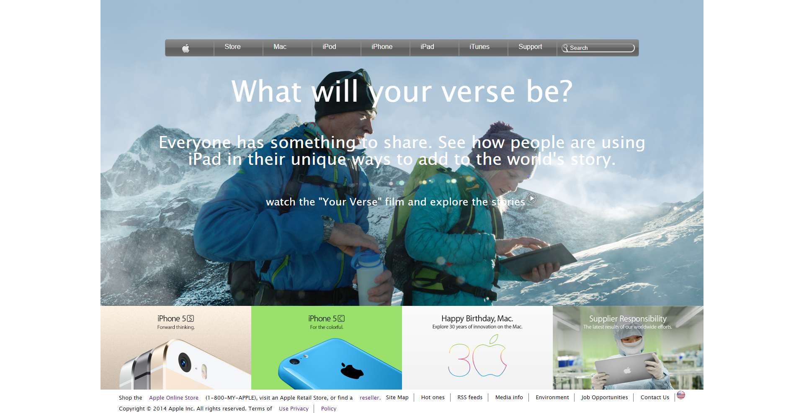

# Apple

> This project consists of building the official apple Web page (not the current version) using HTML and CSS. The main objective is to learn how to implement background images and gradients using CSS.

Live demo link : https://rawcdn.githack.com/balerum03/apple/c5b59502d988441459bd863b29969dbbf56892e3/apple-replica.html

## Built With

- HTML
- CSS

👤 Adan Fernandez Bonilla.

- Github: @balerum03
- Twitter: @balerum03
- Linkedin: https://www.linkedin.com/in/adan-fernandez-bonilla-4560831a5                                          \

## 🤝 Contributing

Contributions, issues and feature requests are welcome!

Feel free to check the [issues page](https://github.com/balerum03/apple/issues).

## Show your support

Give a ⭐️ if you like this project!

## 📝 License

This project is [MIT](lic.url) licensed.
